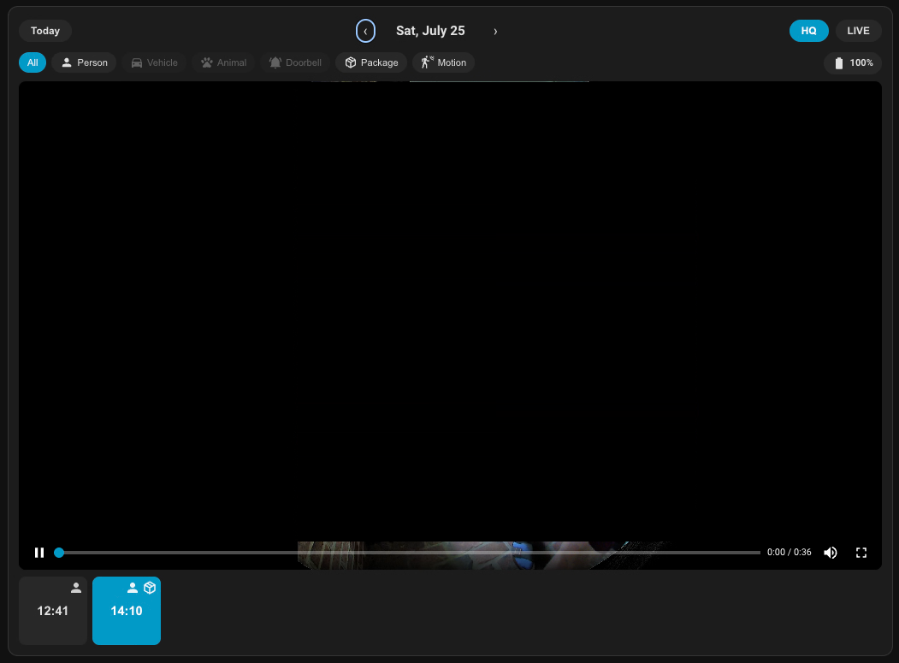
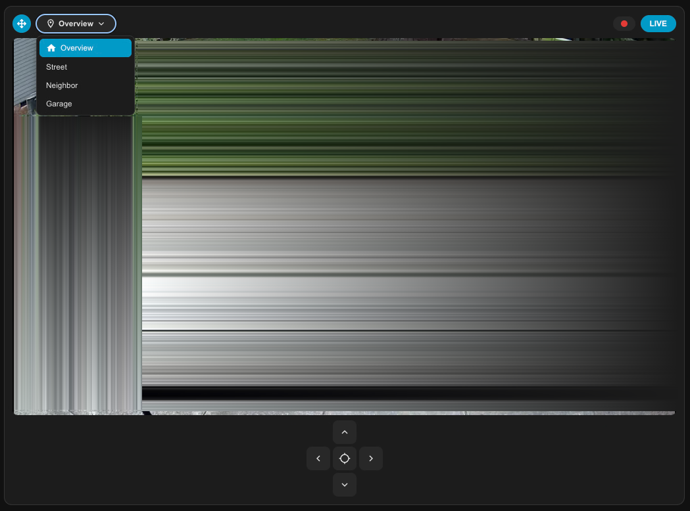

# Reolink Hub Playback Bridge

A custom Home Assistant integration and Lovelace card for Reolink **Home Hub / NVR**
owners whose recorded-clip playback is unusably slow. It swaps the CGI command Home
Assistant uses to fetch clips for the one Reolink's own app already uses, and ships a
player that decodes what comes back.

## Why?

Home Assistant's built-in `reolink` integration resolves recorded clips on hub/NVR-class
devices (`is_hub` / `is_nvr`) via the `Download`/`NvrDownload` CGI command. On a Reolink
Home Hub that command is throttled to roughly 200-250KB/s regardless of the clip's actual
resolution or bitrate, and it ignores HTTP Range requests entirely, so there's no seeking
either. A 30-second clip can take half a minute just to buffer.

The Home Hub's own web client doesn't use `Download`/`NvrDownload` for this. It uses
`Playback`, which isn't throttled. Switching to it uncovers a second problem: the Home
Hub serves the response as raw FLV no matter what the filename says, and no browser can
decode FLV through a plain `<video>` tag. This project resolves clips via `Playback`
instead, demuxes the FLV client-side with [mpegts.js](https://github.com/xqq/mpegts.js)
into fragmented MP4 fed through Media Source Extensions, and wraps the result in a
Lovelace card so it's actually usable day to day rather than a proof of concept sitting
in a `media_source` browser.

The full root-cause writeup, including a HAR-confirmed trace of the throttling and the
FLV mislabeling, is in
[starkillerOG/reolink_aio#184](https://github.com/starkillerOG/reolink_aio/issues/184).
The short version from that thread: this can't go into `reolink_aio` itself because
Home Assistant's built-in cards don't support FLV. The maintainer's response was that
other people hitting the same throttling could still benefit from it existing
somewhere, which is why it's a standalone project instead.

## Features

- Recorded-clip playback via the Home Hub's unthrottled `Playback` CGI command instead
  of the throttled `Download`/`NvrDownload` path
- Day stepper with a calendar popup, and a scrollable clip strip per day
- AI-trigger filter chips (person, vehicle, animal, and others Reolink detects)
- Live view through the same FLV/mpegts.js pipeline, with a quality toggle between the
  full-resolution main stream and the always-playable sub stream
- Optional PTZ controls (pan/tilt/zoom, presets) for cameras that support them
- Optional manual-record button, wired to whatever switch/timer entity you set up

## Requirements

- A Reolink **Home Hub or NVR** with cameras registered through it. Standalone
  (non-hub) Reolink cameras aren't routed through the throttled code path in the
  built-in integration to begin with, so this project has nothing to fix for them.
- Home Assistant with the built-in `reolink` integration already configured. This
  reuses that integration's existing authenticated connection rather than storing its
  own credentials.
- A browser with MediaSource Extensions support (all current major browsers qualify).

## A note on scope

A caution before you install this: it was built with heavy AI assistance and tested
against exactly one setup, a single Reolink Home Hub with four cameras (a Video
Doorbell, an E1 Zoom, and two Argus PT Ultra units). It hasn't been tested against any
other hub, NVR, or camera combination, and it isn't maintained with other setups in
mind. It's here for anyone who wants to try it or fork it for their own hardware,
though. The code hasn't been audited line by line against `reolink_aio`'s internals
either, which is worth knowing before you rely on it.

## Screenshots

| Recorded clips | Live view with PTZ |
|---|---|
|  |  |

## Installation

### HACS (custom repository)

1. In HACS, open the three-dot menu → **Custom repositories**.
2. Add this repository's URL with category **Integration**.
3. Search for "Reolink Hub Playback Bridge" and install.
4. Restart Home Assistant.
5. Add the two files under `www/reolink-hub-playback-bridge/` as Lovelace resources.
   Home Assistant only auto-registers frontend resources for HACS repositories
   installed under the "plugin" category. This repo installs as an "Integration," so
   you need to register them yourself:
   1. Make sure your user profile has **Advanced Mode** turned on (**Settings →
      People → your profile**, toggle **Advanced Mode** near the bottom). The
      Resources page is hidden without it.
   2. Go to **Settings → Dashboards**, open the three-dot menu (⋮) in the top right,
      and choose **Resources**.
   3. Click **Add Resource** and add both, in this order:
      - `/local/reolink-hub-playback-bridge/mpegts.js`, Resource type: **JavaScript
        Module**
      - `/local/reolink-hub-playback-bridge/reolink-hub-playback-bridge-card.js`,
        Resource type: **JavaScript Module**

      Order matters here: the card checks for `window.mpegts` when it loads and
      won't work if it loads first. Resources load in the order they're listed on
      this page, so `mpegts.js` needs to be added, and appear, above the card.
   4. Hard-refresh your browser (Cmd/Ctrl+Shift+R) to clear any cached copy.

   If you update the card later, your browser may keep serving a stale cached copy.
   Appending a version marker to the URL (e.g. `...card.js?v=2`) after an update
   forces a fresh fetch.

### Manual

1. Copy `custom_components/reolink_hub_playback_bridge/` into your HA config's
   `custom_components/` directory.
2. Copy `www/reolink-hub-playback-bridge/` into your HA config's `www/` directory.
3. Add both JS files (`mpegts.js` first) as Lovelace resources, following step 5
   above.
4. Restart Home Assistant.

## Configuration

HACS only places the files, it doesn't touch `configuration.yaml`. After installing
(either method above), add one line yourself:

```yaml
reolink_hub_playback_bridge:
```

This integration doesn't have a config flow yet, so it can't be set up through
**Settings → Devices & Services**, YAML is the only way to enable it for now.
Restart Home Assistant after adding it. Everything else (which cameras, which
entities) lives on the card's own config, not here.

Every camera's config can be filled in automatically: open the card's visual editor and
pick the device, and a WebSocket call resolves the rest (media source IDs, PTZ entities,
and so on) for you.

| Field | Required | Description |
|---|---|---|
| `media_source_id` | Yes | A `media-source://reolink_hub_playback_bridge/RES\|...` identifier, normally auto-filled by the device picker. |
| `live_camera_entity` | No | Camera entity to show in live view. |
| `record_switch_entity` | No | A `switch` entity for a manual-record button, shown only while live view is active. |
| `battery_entity` | No | A `sensor` entity for a battery badge. |
| `battery_dashboard_path` | No | A path within your own HA frontend to deep-link to when the battery badge is tapped (e.g. a dashboard view with battery history). No badge tap action if unset. |
| `ptz_pad_entity_prefix` | No | Prefix for per-direction `button` entities (e.g. `button.patio_ptz` for `button.patio_ptz_up`, `_down`, and so on). Enables the PTZ pad. |
| `ptz_preset_entity` | No | A `select` entity whose `options` populate the preset pill list. |
| `ptz_guard_entity` | No | A `button` entity for a "return to default position" action. |
| `ptz_zoom_entity` | No | A `number` entity for a zoom rocker, on cameras with motorized zoom. |
| `hq_available` | No | Whether the high-resolution stream is offered at all. Defaults to off. |
| `hq_default` | No | Whether high resolution is the opening quality when `hq_available` is set. |
| `calendar_trigger_highlighting` | No | Set to `false` to skip fetching per-day AI-trigger summaries for the calendar popup. Defaults to on. |
| `cross_origin_host` | No | Routes VOD/live stream requests through a second origin pointed at the same backend. Only needed if you hit a Home Assistant frontend Service Worker bug that intermittently corrupts large chunked-transfer fetches; most setups won't need this. |

## Known limitations

- High-resolution ("Clear"/4K/HEVC) playback can be inconsistent. It plays reliably on
  some clips and stutters or drops frames on others. This tracks scene complexity more
  than any particular camera model in testing so far, and the exact cause hasn't been
  pinned down. See the linked issue for more detail.
- The PTZ preset select entity isn't named consistently across camera models (some
  repeat the device name in the entity ID). The backend matches by substring rather
  than a fixed template, but an unusual naming scheme on a model this wasn't tested
  against could still slip through.
- Seeking beyond what's already buffered may not work mid-clip, since the Home Hub
  doesn't support HTTP Range requests.

## License

The original code in this repository is MIT licensed, see [LICENSE](LICENSE). The
vendored `mpegts.js` is Apache License 2.0, see
[THIRD_PARTY_NOTICES.md](THIRD_PARTY_NOTICES.md).
